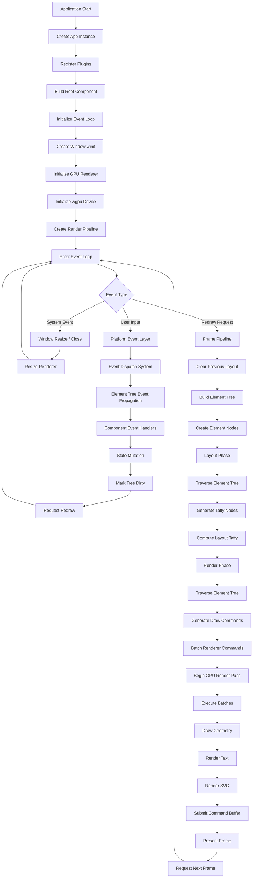

# Rupaui Documentation Index

Welcome to the **Rupaui** documentation. Rupaui is a modern, cross-platform UI framework built with Rust, designed for artisans who value semantic structure and utility-first flexibility.

## 🚀 Architecture Pipeline

## 🏗 Core Framework
- [Philosophy](./core/philosophy.md)
- [State Management](./core/state-management.md)
- [Plugins](./core/plugins.md)
- [Extending Rupaui](./core/extending.md)
- [Platforms](./core/platforms.md)
- [Control Flow](./core/control-flow.md)
- [Attributes](./core/attributes.md)
- [Vector Math](./core/vector-math.md)

## 🎨 DNA Visual (Styling)
- [Styling Overview](./styling/styling.md)
- [Theme Engine](./styling/theme.md)
- [Modular Styling](./styling/modular-styling.md)
- [Spacing & Sizing](./styling/spacing-sizing.md)
- [Background & Border](./styling/background-border.md)
- [Typography](./styling/typography.md)
- [Effects & Shadows](./styling/effects.md)
- [Filters](./styling/filters.md)
- [Motion & Transform](./styling/motion-transform.md)
- [Interactivity & SVG](./styling/interactivity-svg.md)
- [Layout System](./styling/layout.md)
- [Utility Helpers](./styling/helpers.md)
- [Variants](./styling/variants.md)
- [Tables](./styling/tables.md)

## 🧩 Components
- [Brand](./components/brand.md)
- [Div](./components/div.md)
- [Elements](./components/elements.md)
- [Forms](./components/forms.md)
- [Layout](./components/layout.md)
- [Section](./components/section.md)
- [SVG Drawing](./components/svg-drawing.md)
- [Text](./components/text.md)
- [Theme Switcher](./components/theme-switcher.md)
- [Viewport](./components/viewport.md)
- [Window](./components/window.md)
