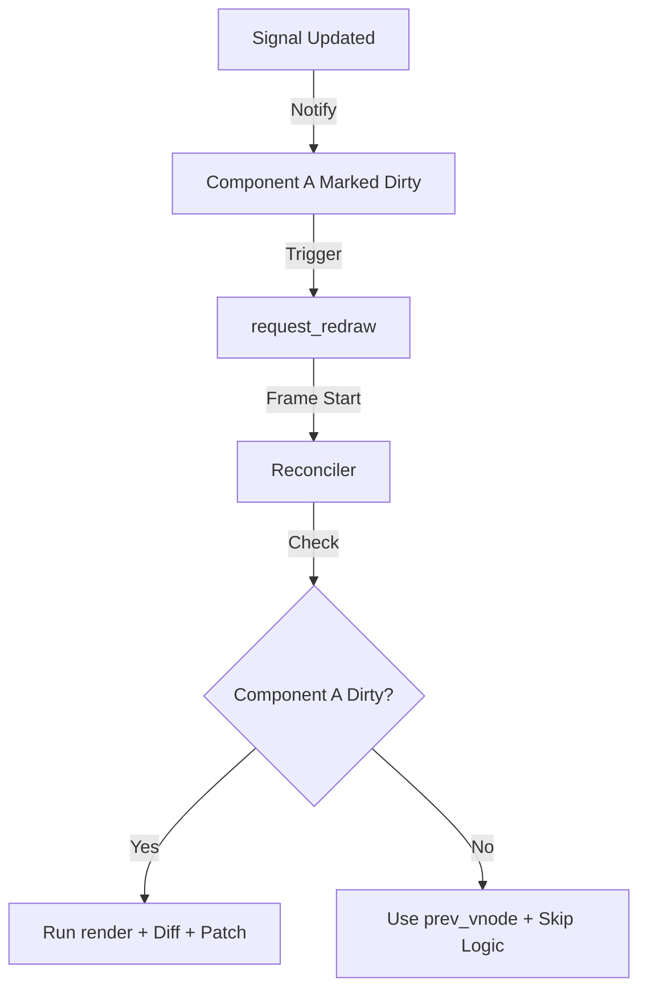

# Fine-Grained Reactivity & Updates ⚡

Rupa Framework uses a **Push-Pull Reactive Graph** to ensure maximum performance. The goal is simple: **If state doesn't change, the CPU shouldn't work.**

---

## 1. The Reactive Core (Signals)

The system is built on three primitives in `rupa-signals`:
*   **Signal<T>**: The source of truth (Atomic State).
*   **Memo<T>**: Derived state that only re-calculates if its dependencies change.
*   **Effect**: A side-effect that runs automatically when dependencies change.

---

## 2. Component-Level Tracking

To achieve selective re-rendering, Rupa connects the **Reactive Graph** to the **Component Tree**:

1.  **Subscription**: When a component's `render()` method is called, the framework tracks which `Signals` are accessed (read).
2.  **Dirty Marking**: When a `Signal` is updated, it notifies all "subscriber" components by setting their `ViewCore::is_dirty` flag to `true`.
3.  **Scheduled Redraw**: The framework signals the OS (via `request_redraw`) that a change has occurred.

---

## 3. Selective Reconciliation (The "Skip" Logic)

During the next frame, the `Reconciler` performs a smart traversal:

*   **If Component is CLEAN (`is_dirty == false`)**:
    *   The engine **skips** the `render()` call entirely.
    *   It reuses the `prev_vnode` snapshot from `ViewCore`.
    *   It continues to check children (in case a child component is dirty).
*   **If Component is DIRTY (`is_dirty == true`)**:
    *   The engine executes `render()` to get a new `VNode` tree.
    *   It diffs the new tree against `prev_vnode`.
    *   It generates patches and clears the dirty flag.

---

## 4. Implementation Strategy

### A. Global Tracking Context
We will implement a thread-local `RUNTIME` in `rupa-signals` that keeps track of the "Currently Rendering Component ID".

### B. Signal Integration
Every time `signal.get()` is called:
*   It checks the `RUNTIME` context.
*   If a component ID is present, the signal adds that component to its `subscribers` list.

### C. The Dispatcher
When `signal.set()` is called:
*   The signal iterates through its `subscribers`.
*   It calls `component.mark_dirty()`.
*   It triggers a global `request_redraw()`.

---

## 5. Visualizing the Update Flow

