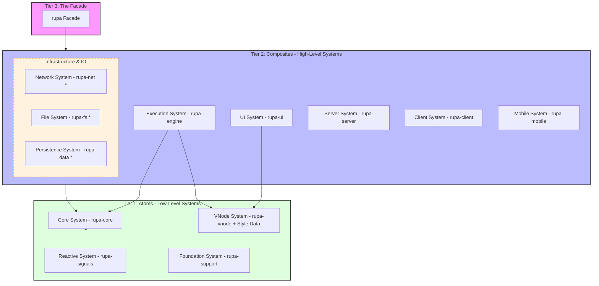
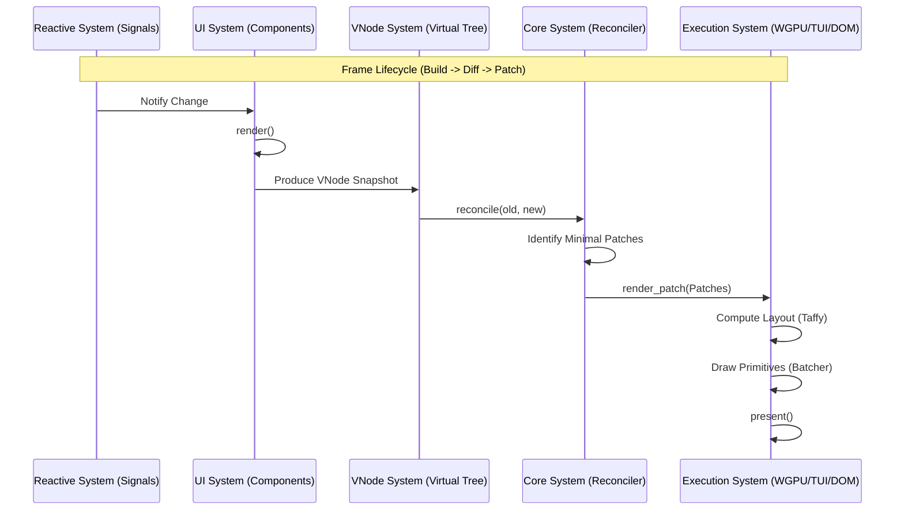

# Rupa Framework Architectural Blueprint 🏛️

This document defines the structural integrity, dependency hierarchy, and execution flow of the **Rupa Framework**, a **modular meta-framework, cross-platform and multi-purpose**. It serves as the authoritative map for all engineering activities, ensuring compliance with the **ISO-IEC-12207-GEM-2026** governance.

---

## 1. Governance & Principles (The 3S Doctrine)

Every architectural decision in Rupa MUST be defensible under these three pillars:

*   **Secure (S1):** Protection of state integrity, strict boundary contracts, and deterministic failure semantics.
*   **Sustain (S2):** Semantic clarity, documentation parity, and reduced cognitive load through modularity.
*   **Scalable (S3):** Zero-cost abstractions, controlled dependency growth, and predictable performance under expansion.

---

## 2. Tiered Sub-System Architecture (The Macro View)

Rupa is organized into logical **Sub-Systems** that interact across three tiers based on the **[Atoms & Composites](./architectures/atoms-and-composites.md)** design pattern.

---

## 3. Sub-System Definitions & Responsibilities

### 3.1 Core & Reactive Systems (The Brain)
*   **Reactive System (`rupa-signals`)**: The "Nervous System". Handles fine-grained state tracking via `Signal` and `Memo`. It is the source of all UI updates.
*   **VNode System (`rupa-vnode`)**: The "Universal Language & DNA". Provides the agnostic virtual tree structure **and the core Style data models** for cross-platform rendering.
*   **Core System (`rupa-core`)**: The "Orchestrator". Manages component lifecycles, VNode reconciliation (Diff/Patch), and universal event dispatching.

### 3.2 UI System (The Body)
*   **UI System (`rupa-ui`)**: The "Artisan Library & Styling API". It is divided into two major sub-systems:
    *   **Component System**: High-level semantic components (VStack, Button, Modal, Forms) built on top of layout primitives.
    *   **Utilities System**: The utility-first Styling API (`px`, `my`, `bg`, `rounded`) providing a fluent interface for building visual identities.

### 3.3 Platform & Execution Systems (The Muscles)
*   **GUI System (`rupa-engine::gui`)**: Hardware-accelerated rendering via **WGPU**. Handles vertex batching and SDF shaders.
*   **TUI System (`rupa-engine::tui`)**: Optimized terminal rendering via **Crossterm**. Handles ANSI diffing and double-buffering.
*   **Server System (`rupa-server`)**: SSR Engine. Handles HTML serialization and backend integration (Axum/Tokio).
*   **Client System (`rupa-client`)**: Web Runtime. Handles WASM hydration and direct DOM manipulation.

### 3.4 Infrastructure Sub-Systems (Strategic Foundations)
*   **Persistence System (`rupa-data`*)**: The "Memory". Strategic ORM/Database bridge for local (SQLite/IndexedDB) and remote data persistence.
*   **Network System (`rupa-net`*)**: The "Bridge". Strategic IO system for HTTP/gRPC/WebSockets, integrated directly into the reactive engine.
*   **File System (`rupa-fs`*)**: The "Asset Manager". Handles localized resource loading (images, fonts, configs) across Desktop and Mobile.

---

## 4. Internal Module Architecture (Detailed Mapping)

| Sub-System | Primary Modules | Key Exports |
| :--- | :--- | :--- |
| **Core** | `component`, `renderer`, `view`, `events`, `scene` | `Component`, `Renderer`, `ViewCore`, `UIEvent` |
| **UI** | `primitives`, `elements`, `style`, `body` | `Div`, `Button`, `VStack`, `Style (Builder)` |
| **Engine** | `platform`, `renderer`, `scene`, `shaders` | `App`, `GuiRenderer`, `TuiRenderer`, `LayoutEngine` |
| **VNode** | `vnode`, `style/*` | `VNode`, `Style (Data)`, `Color` |
| **Signals** | `signal`, `memo`, `effect`, `runtime` | `Signal`, `Memo`, `Effect` |

---

## 5. Execution Pipeline (The Reactive Render Loop)

---

## 6. Architectural Constraints & Standards

1.  **Strict Layering**: Tier 1 (Atoms) must never import from Tier 2 (Composites).
2.  **Agnostic Purity**: Core and UI systems must remain 100% free of OS-specific or hardware-specific code.
3.  **Serializability**: All data crossing system boundaries (VNodes, Styles, Events) MUST implement `serde`.
4.  **TDD Driven**: Every sub-system must be independently testable in a headless environment.
