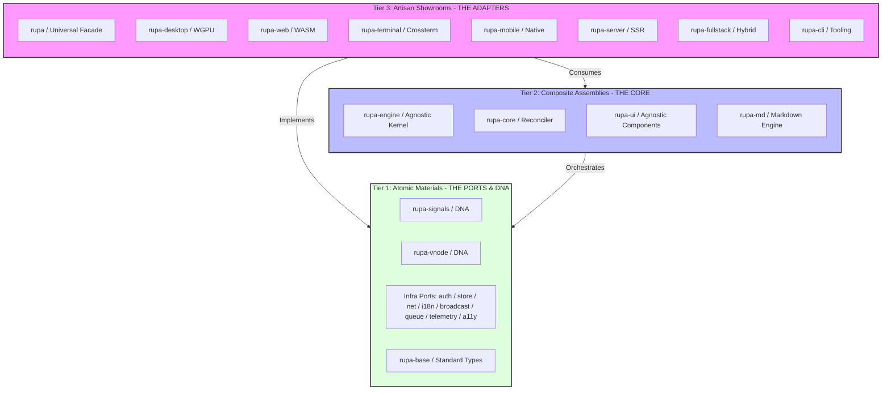
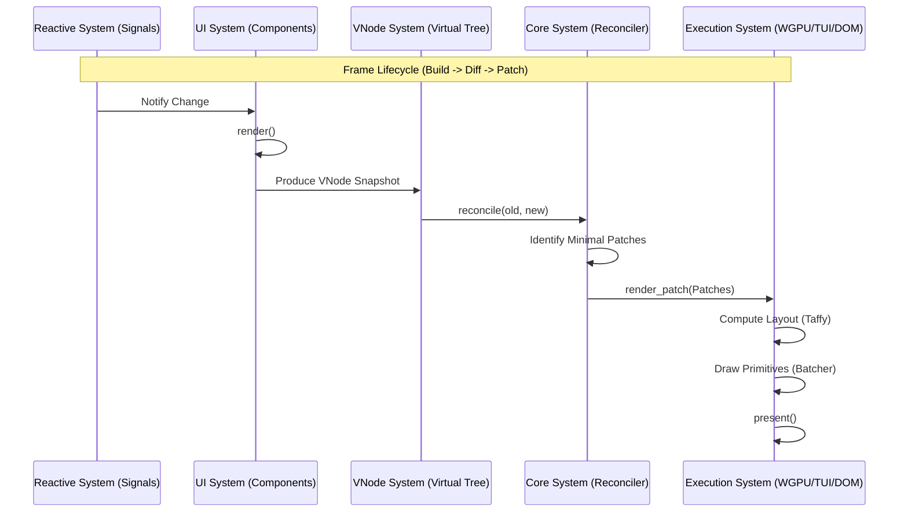
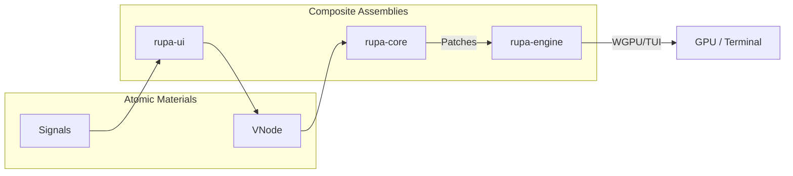
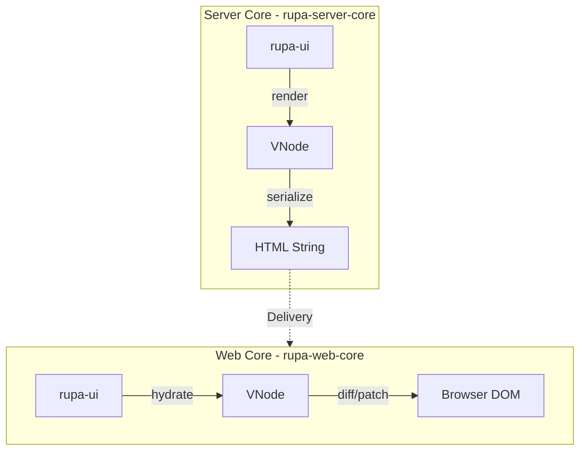

# Rupa Framework Architectural Blueprint 🏛️

This document defines the structural integrity, dependency hierarchy, and execution flow of the **Rupa Framework**, a **modular meta-framework, cross-platform and multi-purpose**. It serves as the authoritative map for all engineering activities, ensuring compliance with the **ISO-IEC-12207-GEM-2026** governance.

---

## 1. Governance & Principles (The 3S Doctrine)

Every architectural decision in Rupa MUST be defensible under these three pillars:

*   **Secure (S1):** Protection of state integrity, strict boundary contracts, and deterministic failure semantics.
*   **Sustain (S2):** Semantic clarity, documentation parity, and reduced cognitive load through modularity.
*   **Scalable (S3):** Zero-cost abstractions, controlled dependency growth, and predictable performance under expansion.

---

## 2. Tiered Hexagonal Architecture (The Macro View)

Rupa Framework is organized into three layers of responsibility, following the **Ports and Adapters** model to achieve *zero-coupling* between core logic and infrastructure.

---

## 3. Sub-System Definitions & Responsibilities

### 3.1 The DNA & Ports (Tier 1)
*   **The DNA**: `rupa-signals` (Fine-grained reactivity) and `rupa-vnode` (Universal UI language).
*   **The Ports**: Foundational traits that define *what* the system can do.
    *   `auth::Service`, `store::Store`, `net::Client`, `broadcast::Broadcaster`.
*   **Standard Materials**: `rupa-base` (Types), `rupa-motion` (Animation), `rupa-test` (TDD Support).

### 3.2 The Core Kernel (Tier 2)
*   **The Brain**: `rupa-core`. Manages the virtual tree, diffing algorithm, and action dispatching.
*   **The Orchestrator**: `rupa-engine`. Manages the universal application lifecycle (`App`).
*   **The Toolkit**: `rupa-ui` (Platform-agnostic semantic components) and `rupa-md` (Content engine).

### 3.3 The Showroom Adapters (Tier 3)
*   **Platform Targets**: 
    *   `rupa-desktop` (GPU), `rupa-terminal` (ANSI), `rupa-web` (Browser).
    *   `rupa-mobile` (Android/iOS), `rupa-server` (SSR/API).
*   **Hybrid Solutions**: `rupa-fullstack` manages hydration between server and client.
*   **Artisan Tools**: `rupa-cli` for scaffolding and developer experience.
*   **Universal Facade**: The `rupa` crate provides a unified entry point for all features.

---

## 4. Internal Module Architecture (Detailed Mapping)

| Sub-System | Primary Modules | Key Exports (Ergonomic) |
| :--- | :--- | :--- |
| **Core** | `reconciler`, `renderer`, `view`, `events` | `Core`, `Renderer`, `Patch` |
| **UI** | `elements`, `primitives`, `style` | `Button`, `Div`, `Theme` |
| **Signals** | `signal`, `memo`, `effect` | `Signal`, `Memo`, `Effect` |
| **VNode** | `vnode`, `style/*` | `VNode`, `Style`, `Color` |
| **Auth** | `identity`, `session`, `rbac`, `teams` | `User`, `Status`, `Service`, `Port` |
| **Store** | `store`, `signal`, `backends` | `Store`, `PersistentSignal`, `Cache` |
| **Net** | `client`, `resource` | `Client`, `Resource`, `Fetch` |
| **Motion** | `spring`, `transition`, `timeline` | `Spring`, `Transition`, `Easing` |
| **i18n** | `provider`, `dictionary`, `locale` | `Provider`, `Translator`, `translate` |
| **Queue** | `task`, `queue` | `Task`, `Queue`, `Handle` |
| **Forms** | `validation`, `rules`, `form` | `Form`, `Field`, `Validator` |
| **A11y** | `bridge`, `node`, `translate` | `Bridge`, `Node`, `Manager` |
| **Context** | `registry`, `provider` | `Registry`, `use_context` |
| **Telemetry**| `logger`, `metrics`, `profiler` | `Telemetry`, `Logger`, `Recorder` |
| **Test** | `headless`, `snapshot` | `Tester`, `Snapshot`, `setup` |

---

## 5. Execution Pipeline (The Reactive Render Loop)

---

## 6. Modular Pipeline Workflows (The Modular Choice)

Rupa Framework adapts its execution pipeline based on the target application. Below are the visual representations of how Atomic Materials and Composite Assemblies are assembled for different purposes.

### 6.1 Native Pipeline (Desktop & Mobile)
Focused on high-performance GPU/TUI rendering with direct hardware access.

### 6.2 Full-Stack Web Pipeline (SSR + Hydration)
Focused on SEO-friendly initial delivery and reactive client-side interactivity.

---

## 7. Architectural Constraints & Standards

1.  **Strict Layering**: Atomic Materials (Tier 1) must never import from Composite Assemblies (Tier 2).
2.  **Agnostic Purity**: Foundational Atomic Materials must remain 100% free of OS-specific or hardware-specific code.
3.  **Serializability**: All data crossing system boundaries (VNodes, Styles, Events) MUST implement `serde`.
4.  **TDD Driven**: Every sub-system must be independently testable in a headless environment.
