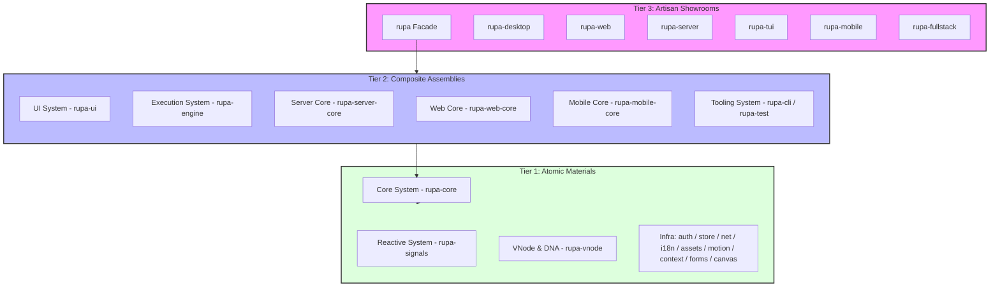
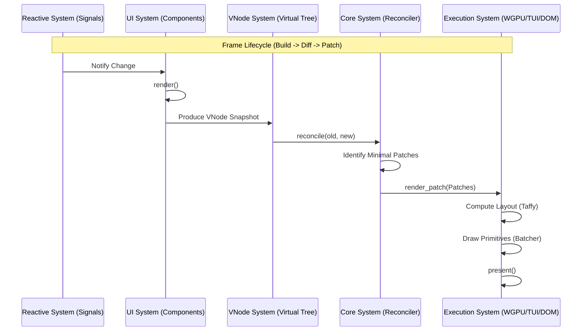
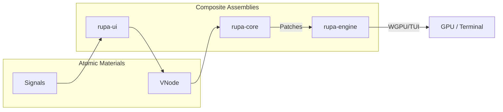
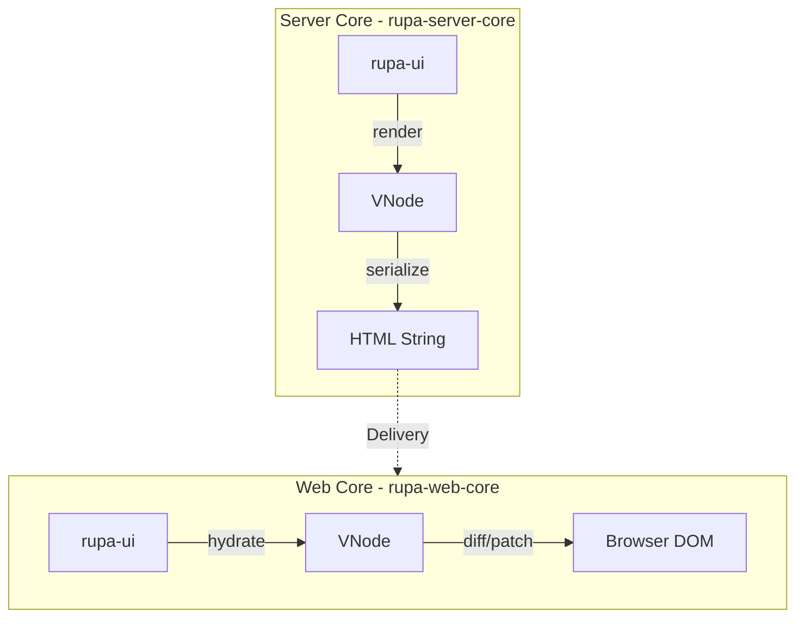

# Rupa Framework Architectural Blueprint 🏛️

This document defines the structural integrity, dependency hierarchy, and execution flow of the **Rupa Framework**, a **modular meta-framework, cross-platform and multi-purpose**. It serves as the authoritative map for all engineering activities, ensuring compliance with the **ISO-IEC-12207-GEM-2026** governance.

---

## 1. Governance & Principles (The 3S Doctrine)

Every architectural decision in Rupa MUST be defensible under these three pillars:

*   **Secure (S1):** Protection of state integrity, strict boundary contracts, and deterministic failure semantics.
*   **Sustain (S2):** Semantic clarity, documentation parity, and reduced cognitive load through modularity.
*   **Scalable (S3):** Zero-cost abstractions, controlled dependency growth, and predictable performance under expansion.

---

## 2. Tiered Sub-System Architecture (The Macro View)

Rupa is organized into logical **Sub-Systems** that interact across three tiers based on the **[Artisan Workshop Standard](./architectures/workshop-tiers.md)** design pattern.

---

## 3. Sub-System Definitions & Responsibilities

### 3.1 Core & Reactive Systems (The Brain)
*   **Reactive System (`rupa-signals`)**: The "Nervous System". Handles **[Fine-Grained Updates](./reactivity/fine-grained-updates.md)** via `Signal` and `Memo`.
*   **VNode & DNA (`rupa-vnode`)**: The "Universal Language". Agnostic virtual tree structure and core style data models.
*   **Core System (`rupa-core`)**: The "Orchestrator". Manages component lifecycles and **[VNode Reconciliation](./architectures/reconciliation.md)**.

### 3.2 UI & Visual Systems (The Body)
*   **UI System (`rupa-ui`)**: Houses the **UI Component System** (Semantic elements) and **UI Utilities System** (Styling API).
*   **Motion Engine (`rupa-motion`)**: High-performance VNode interpolation and spring physics.
*   **Canvas System (`rupa-canvas`)**: Low-level hardware-accelerated drawing and custom shaders.

### 3.3 Platform & Execution Systems (The Muscles)
*   **Native Engines**: `rupa-engine` (GPU/TUI), `rupa-mobile-core`.
*   **Web Engines**: `rupa-server-core` (SSR), `rupa-web-core` (WASM).
*   **Tooling**: `rupa-cli` (DevOps), `rupa-test` (QA).

### 3.4 Enterprise Infrastructure Systems (The Foundation)
*   **Identity (`rupa-auth`)**: Reactive authentication, RBAC, and Team management.
*   **Persistence (`rupa-store`)**: "Storage as a Signal" bridge for SQLite, FS, and WebStorage.
*   **Connectivity**: `rupa-net` (Async I/O), `rupa-router` (Navigation), `rupa-i18n` (Voice).
*   **Management**: `rupa-assets` (Warehouse), `rupa-context` (DI), `rupa-telemetry` (Observability).

---

## 4. Internal Module Architecture (Detailed Mapping)

| Sub-System | Primary Modules | Key Exports |
| :--- | :--- | :--- |
| **Core** | `component`, `renderer`, `view`, `events` | `Component`, `Renderer`, `ViewCore` |
| **UI** | `elements`, `primitives`, `style` | `Button`, `Div`, `Theme` |
| **Signals** | `signal`, `memo`, `effect` | `Signal`, `Memo`, `Effect` |
| **VNode** | `vnode`, `style/*` | `VNode`, `Style`, `Color` |
| **Auth** | `identity`, `session`, `rbac`, `teams` | `User`, `Session`, `Role` |
| **Store** | `store`, `signal`, `backends` | `Store`, `PersistentSignal` |
| **Net** | `client`, `resource` | `Client`, `Resource`, `fetch` |
| **Motion** | `spring`, `transition`, `timeline` | `Spring`, `Transition` |
| **Router** | `router`, `route`, `history` | `Router`, `Route`, `use_route` |
| **i18n** | `provider`, `dictionary`, `locale` | `I18nProvider`, `t!`, `Locale` |
| **Assets** | `manager`, `loader`, `cache` | `AssetManager`, `use_asset` |
| **A11y** | `bridge`, `translate` | `A11yBridge` |
| **Context** | `provider`, `consumer` | `Provider`, `use_context` |
| **Telemetry**| `metrics`, `profiler`, `logger` | `Metrics`, `Profiler` |

---

## 5. Execution Pipeline (The Reactive Render Loop)

---

## 6. Modular Pipeline Workflows (The Modular Choice)

Rupa Framework adapts its execution pipeline based on the target application. Below are the visual representations of how Atomic Materials and Composite Assemblies are assembled for different purposes.

### 6.1 Native Pipeline (Desktop & Mobile)
Focused on high-performance GPU/TUI rendering with direct hardware access.

### 6.2 Full-Stack Web Pipeline (SSR + Hydration)
Focused on SEO-friendly initial delivery and reactive client-side interactivity.

---

## 7. Architectural Constraints & Standards

1.  **Strict Layering**: Atomic Materials (Tier 1) must never import from Composite Assemblies (Tier 2).
2.  **Agnostic Purity**: Foundational Atomic Materials must remain 100% free of OS-specific or hardware-specific code.
3.  **Serializability**: All data crossing system boundaries (VNodes, Styles, Events) MUST implement `serde`.
4.  **TDD Driven**: Every sub-system must be independently testable in a headless environment.
