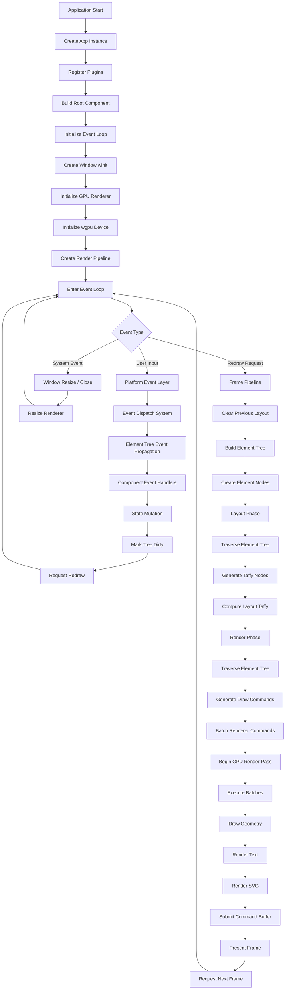

# Project Overview 🎨

**Rupa Framework** is a modern, high-performance cross-platform UI framework for Rust. It is engineered for artisans who demand the perfect balance between **Semantic Structure** and **Utility-First Flexibility**.

Inspired by the ergonomics of TailwindCSS and the reliability of Bootstrap, Rupa Framework provides a type-safe, reactive engine built directly on top of hardware-accelerated primitives.

---

## 🌟 Key Features

- **Utility-First, Semantic-Support**: Compose complex visual identities using a functional API while maintaining a clean, meaningful component hierarchy.
- **Logic & View Pattern**: A strictly enforced separation between UI state (Logic) and rendering infrastructure (View), ensuring testability and modularity.
- **Signal-Based Reactivity**: Fine-grained state management using `Signal` and `Memo` for zero-overhead UI updates, automatically triggering hardware-accelerated redraws.
- **Hardware-Accelerated Rendering**: Built on **WGPU** with a specialized **2D Batch Renderer** for high-performance primitives (rects, shapes).
- **Industrial Layout Engine**: Powered by **Taffy**, providing full support for Flexbox and CSS Grid layouts.
- **Interactive Event System**: Full support for **Hit-Testing** and event dispatching (Click, Hover, Drag, Scroll) linked directly to the layout engine.
- **Artisan Color System**: Native support for **OKLCH** color space for perceptually uniform aesthetics and precise theme control.

---

## 🚀 Execution Pipeline

The following diagram illustrates the lifecycle of a Rupa Framework application, from initialization to the reactive render loop.

---

## 🛠 Tech Stack

Rupa Framework stands on the shoulders of the Rust ecosystem's most powerful crates:

| Layer | Technology |
| :--- | :--- |
| **Graphics API** | [WGPU](https://wgpu.rs/) |
| **Layout Algorithm** | [Taffy](https://github.com/DioxusLabs/taffy) |
| **Windowing & Events** | [Winit](https://github.com/rust-windowing/winit) |
| **Text Rendering** | [Glyphon](https://github.com/grovesNL/glyphon) |
| **Reactivity** | Custom Signal/Memo Engine |
| **Color Math** | OKLCH (Custom Implementation) |
