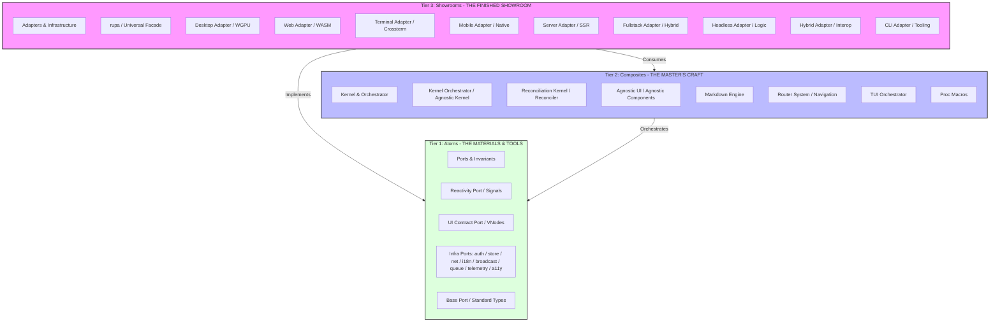
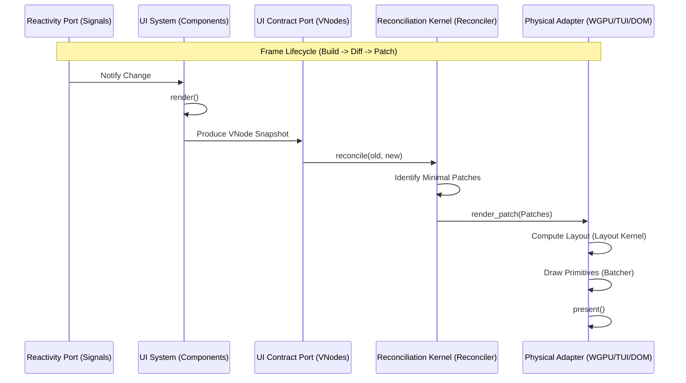
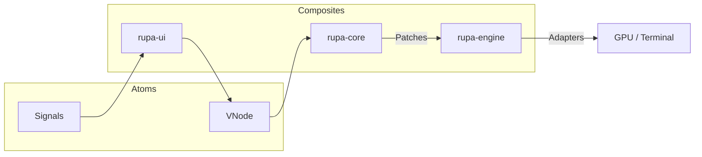

# Rupa Framework Architectural Blueprint 🏛️

This document defines the structural integrity, dependency hierarchy, and execution flow of the **Rupa Framework**, based on the **Atoms and Composites** architectural model.

---

## 1. Governance & Principles (The 3S Doctrine)

Every architectural decision in Rupa MUST be defensible under these three pillars:

*   **Secure (S1):** Protection of state integrity, strict boundary contracts, and deterministic failure semantics.
*   **Sustain (S2):** Semantic clarity, documentation parity, and reduced cognitive load through modularity.
*   **Scalable (S3):** Zero-cost abstractions, controlled dependency growth, and predictable performance under expansion.

---

## 2. Atoms and Composites (The Macro View)

Rupa Framework is organized into three tiers, following the **Ports and Adapters** model to achieve *zero-coupling* between core logic and infrastructure.

---

## 3. Sub-System Definitions & Responsibilities

### 3.1 Tier 1: Atoms (The Materials & Tools — Ports & Invariants)
*   **The DNA**: **Reactivity Port** (`rupa-signals`) and **UI Contract Port** (`rupa-vnode`).
*   **The Ports**: Foundational traits that define *what* the system can do.
    *   `auth::Service`, `store::Store`, `net::Client`, `broadcast::Broadcaster`.
*   **Standard Materials**: **Base Port** (`rupa-base`), **Motion Port** (`rupa-motion`), and testing tools.

### 3.2 Tier 2: Composites (The Master’s Craft — Kernel & Orchestrator)
*   **The Brain**: **Reconciliation Kernel** (`rupa-core`). Manages the virtual tree and diffing algorithm.
*   **The Orchestrator**: **Kernel Orchestrator** (`rupa-engine`). Manages the universal application lifecycle (`App`).
*   **The Toolkit**: **Agnostic UI** (`rupa-ui`) and **Markdown Engine** (`rupa-md`).
*   **The Support**: **Router System**, **TUI Orchestrator**, and **Proc Macros**.

### 3.3 Tier 3: Showrooms (The Finished Showroom — Adapters & Infrastructure)
*   **Adapters**: Physical implementations for specific hardware.
    *   **Desktop Adapter** (WGPU), **Terminal Adapter** (Crossterm), **Web Adapter** (Browser).
    *   **Mobile Adapter** (Android/iOS), **Server Adapter** (SSR/API).
*   **Agnostic Adapters**: **Headless Adapter** (Logic-only automation).
*   **Artisan Tools**: **CLI Adapter** for scaffolding and developer experience.
*   **Universal Facade**: The `rupa` crate provides a unified entry point for all features.

---

## 4. Internal Module Architecture (Detailed Mapping)

| System Unit | Primary Modules | Key Exports |
| :--- | :--- | :--- |
| **Reconciliation Kernel** | `reconciler`, `renderer`, `view`, `events` | `Core`, `Renderer`, `Patch` |
| **Agnostic UI** | `elements`, `primitives`, `style` | `Button`, `Div`, `Theme` |
| **Reactivity Port** | `signal`, `memo`, `effect` | `Signal`, `Memo`, `Effect` |
| **UI Contract Port** | `vnode`, `style/*` | `VNode`, `Style`, `Color` |
| **Auth Port** | `identity`, `session`, `rbac`, `teams` | `User`, `Status`, `Service` |
| **Store Port** | `store`, `signal`, `backends` | `Store`, `PersistentSignal` |
| **Net Port** | `client`, `resource` | `Client`, `Resource`, `Fetch` |
| **Motion Port** | `spring`, `transition`, `timeline` | `Spring`, `Transition`, `Easing` |
| **i18n Port** | `provider`, `dictionary`, `locale` | `Provider`, `Translator` |
| **Telemetry Port** | `logger`, `metrics`, `profiler` | `Telemetry`, `Logger` |

---

## 5. Execution Pipeline (The Reactive Render Loop)

---

## 6. Atoms and Composites Workflows (The Modular Choice)

### 6.1 Native Pipeline (Desktop & Mobile)
Focused on high-performance GPU/TUI rendering with direct hardware access.

---

## 7. Architectural Constraints & Standards

1.  **Strict Layering**: Atoms (Tier 1) must never import from Composites (Tier 2).
2.  **Agnostic Purity**: Foundational Atoms must remain 100% free of OS-specific or hardware-specific code.
3.  **Serializability**: All data crossing system boundaries (VNodes, Styles, Events) MUST implement `serde`.
4.  **TDD Driven**: Every sub-system must be independently testable in a headless environment.
