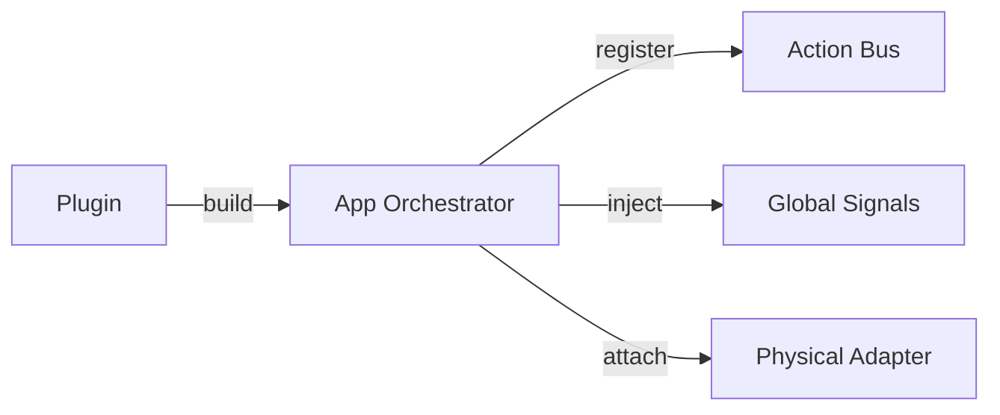

# Plugin System Architecture 🧩

The **Plugin System** is the extensibility gateway of the Rupa Framework. It allows Artisans to inject custom logic, global state, theme presets, or hardware Adapters into the agnostic Kernel.

---

## 1. The Core Contract: `trait Plugin`

Any extension must implement the `Plugin` trait to participate in the application bootstrap.

- **`name()`**: Returns a unique identifier (e.g., `"AuthPlugin"`, `"WGPURenderer"`).
- **`build(app)`**: The primary entry point. It receives mutable access to the `App` instance to register services, handlers, or state.

---

## 2. Technical Orchestration

The `PluginRegistry` manages the lifecycle of all registered plugins:

1.  **Registration**: Plugins are added to the registry during `App` creation.
2.  **Sequencing**: The `App` builds all plugins in the order they were registered.
3.  **Bootstrap**: Once `build_all()` is complete, the Kernel is considered "Prime" and ready for execution.

---

## 3. Interaction Flow

- **Modular Configuration**: Swap a `MemoryStorePlugin` for a `PostgresPlugin` without touching component code.
- **Zero-Knot Coupling**: The Kernel (`rupa-engine`) remains agnostic of specific technologies (like WGPU or SQL) by letting plugins handle the heavy lifting.

---

## 4. Plugin Hierarchy

Following the **3-Tier Architecture**, plugins are typically scoped:
- **Tier 1 (Material)**: Low-level utility injection (e.g., Math, Encryption).
- **Tier 2 (Craft)**: High-level Kernel features (e.g., Router, Forms).
- **Tier 3 (Showroom)**: Hardware manifestation (e.g., Desktop Adapter, Terminal Adapter).
