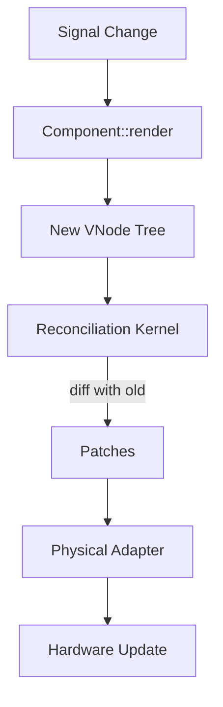

# VNode Contract System (The DNA) 🌳

The **VNode (Virtual Node)** is the universal language of the Rupa Framework. It acts as a platform-agnostic, serializable bridge between high-level Artisan logic and low-level physical Adapters.

---

## 1. The Core Purpose

In a meta-framework, components must not be tied to specific rendering technologies. Instead, they describe **intent** by producing a tree of VNodes.

### Key Benefits:
- **Headless Testing**: Verify UI structure by asserting against VNode trees without a GPU or Window.
- **Multi-Targeting**: The same VNode can become a WGPU primitive, an ANSI character, or an HTML tag.
- **Performance**: Enables O(N) "Diffing" and "Patching," ensuring only changed parts of the UI are updated.

---

## 2. The VNode Enum

A `VNode` is a lightweight, serializable structure representing distinct UI types:

| Variant | Technical Role | Description |
| :--- | :--- | :--- |
| **`Element`** | Structural | A named element (e.g., `"div"`, `"button"`) with styles, attributes, and children. |
| **`Text`** | Content | Raw string content to be shaped and rendered. |
| **`Fragment`** | Logical | A transparent collection of nodes used to group elements. |
| **`Component`** | Placeholder | A metadata marker for a lazily-resolved Artisan component. |
| **`Empty`** | Null | A sentinel node used for conditional rendering. |

---

## 3. VElement Anatomy

The `VElement` contains the metadata required for an **Adapter** to manifest it:

- **Tag**: Semantic identifier (e.g., `"vstack"`, `"button"`).
- **Style**: Agnostic rules (Flex, Grid, OKLCH Colors).
- **Attributes**: Platform-specific key-value pairs.
- **Handlers**: Markers for **Intents** (Submit, Select, Cancel).
- **Motion**: Declarative physics-based animation rules.
- **Key**: Unique ID for reconciliation performance.

---

## 4. The Lifecycle: Build, Diff, Patch

1. **Generation (Tier 2)**: Components produce a fresh VNode snapshot.
2. **Reconciliation (Tier 2)**: The Kernel compares snapshots and issues minimal **Patches**.
3. **Manifestation (Tier 3)**: A **Physical Adapter** executes patches onto the hardware surface.

---

## 5. Architectural Mandates

- **Purity**: No platform-specific logic inside VNodes.
- **Serializability**: MUST implement `serde` for SSR and Polyglot interoperability.
- **Immutability**: VNodes are immutable snapshots. Once produced, they are never modified.
